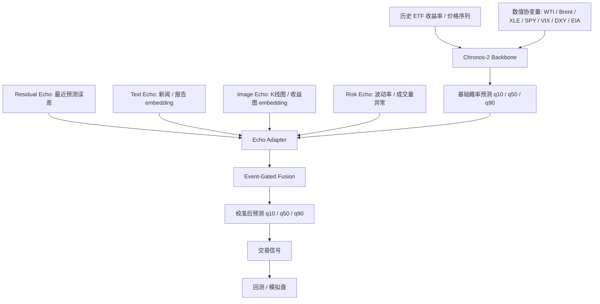

# OilETF-TimeMMD：美股石油 ETF + 新闻多模态数据集构建、Benchmark 与模拟盘方案

> 面向课程 Project Two 的多模态时间序列预测与量化演示方案  
> 目标：自建一个兼容 Time-MMD 思路的美股石油 ETF 多模态数据集，并将预测结果接入 benchmark、回测和模拟盘可视化。

---

## 0. 一句话概括

构建一个以 **USO / BNO / DBO / USL 等美股石油 ETF** 为核心的多模态时间序列数据集：

```text
日频 OHLCV / 技术指标 / 原油与市场协变量
        +
原油、OPEC、EIA、地缘政治、美元、库存等相关新闻与报告文本
        +
由历史窗口生成的 K 线图 / 收益率图像
        ↓
Time-MMD 风格 numerical + textual 数据格式
        ↓
DLinear / PatchTST / Chronos-2 / Aurora / Chronos-2-ECHO benchmark
        ↓
预测收益率、预测区间、交易信号、回测、模拟盘可视化
```

最终交付不是一个单纯的预测表，而是一个可用于 **模型比较 + 多模态消融 + 量化回测 + 模拟盘演示** 的完整小型研究数据集。

---

## 1. 项目目标

### 1.1 数据集目标

构建一个自定义金融多模态时间序列数据集，暂命名为：

> **OilETF-TimeMMD**

核心要求：

- 支持时间序列预测任务：给定历史窗口 `H`，预测未来窗口 `F`。
- 支持多模态输入：数值时序、文本新闻、报告文本、图像模态。
- 支持 benchmark：可接 DLinear、PatchTST、Chronos-2、Aurora、Chronos-2-ECHO。
- 支持交易验证：预测结果可以直接转化为 long/cash 或 ETF 轮动策略。
- 支持模拟盘展示：用 Streamlit / Dash / Backtrader / LEAN 展示信号、持仓、净值和回撤。

### 1.2 研究问题

本项目主要回答四个问题：

1. 对石油 ETF 这种受新闻和宏观事件影响较强的资产，**新闻文本是否提升预测效果**？
2. 把时间序列渲染成 K 线图或收益率图后，**图像模态是否提供额外信息**？
3. Chronos-2 这类支持协变量和概率输出的基础模型，是否比 DLinear / PatchTST 更适合金融模拟盘？
4. 更低的预测误差是否能转化成更好的交易表现，如更高 Sharpe、更低最大回撤和更稳定净值？

---

## 2. 标的范围

第一版建议使用 **4 个主标的 + 2 个压力测试标的**。

| 类型 | ETF | 角色 | 说明 |
|---|---|---|---|
| 主标的 | `USO` | WTI 原油 ETF 主标的 | 最重要的预测对象，适合作为 `OT` 默认目标 |
| 主标的 | `BNO` | Brent 原油 ETF | 用于捕捉 Brent 与 WTI 的差异 |
| 主标的 | `DBO` | 原油期货策略型 ETF | 用于测试不同滚动机制和风险暴露 |
| 主标的 | `USL` | 12 个月 WTI ETF | 相比 USO 更平滑，适合对比期限结构影响 |
| 压力测试 | `UCO` | 2x 杠杆原油 ETF | 可用于高波动压力测试，不建议作为第一版主目标 |
| 压力测试 | `SCO` | 反向/杠杆原油 ETF | 可用于做空环境测试，第一版可暂缓 |

第一版最小实现：

```text
USO + BNO + DBO
```

完整版：

```text
USO + BNO + DBO + USL + UCO + SCO
```

---

## 3. 数据源设计

### 3.1 数据源总览

| 数据层 | 推荐来源 | 数据内容 | 用途 |
|---|---|---|---|
| ETF 价格 | Yahoo Finance / Alpha Vantage / Polygon / Tiingo / FMP | OHLCV、Adj Close、Volume | 主时序、标签、技术指标 |
| 原油价格 | EIA / CME / Nasdaq Data Link / FRED | WTI、Brent、Brent-WTI Spread | 原油基本面协变量 |
| 宏观市场 | FRED / Yahoo Finance / Alpha Vantage | DXY、VIX、SPY、XLE、利率 | 市场环境协变量 |
| 库存数据 | EIA Weekly Petroleum Status Report | 原油库存、汽油库存、馏分油库存 | 周度供需事件 |
| 新闻文本 | Alpha Vantage News、Finnhub、FMP、GDELT、RSS | 新闻标题、摘要、发布时间、来源 | 文本模态 |
| 报告文本 | EIA、OPEC、IEA、CFTC | 周报、月报、库存报告、持仓报告 | 高质量 report 文本 |
| 日历 | NYSE calendar | 交易日、节假日、收盘时间 | 对齐、防泄漏 |

### 3.2 原始数据表

建议保留四类 raw 表。

#### `raw_prices`

```text
symbol, timestamp, open, high, low, close, adj_close, volume, provider
```

示例：

```csv
symbol,timestamp,open,high,low,close,adj_close,volume,provider
USO,2024-01-02,67.10,68.22,66.80,67.95,67.95,5123000,yfinance
BNO,2024-01-02,29.88,30.21,29.70,30.05,30.05,178200,yfinance
```

#### `raw_news`

```text
article_id, published_at_utc, source, title, summary, url_hash,
tickers, entities, sentiment, relevance, provider
```

示例：

```csv
article_id,published_at_utc,source,title,summary,url_hash,tickers,entities,sentiment,relevance,provider
n_0001,2024-01-03T15:40:00Z,EIA,"U.S. crude inventories fall more than expected","EIA reported a larger than expected draw in crude inventories.",abc123,"USO;BNO","EIA;WTI",0.35,0.92,custom
```

#### `raw_oil_macro`

```text
date, wti_close, brent_close, brent_wti_spread,
crude_inventory, gasoline_inventory, distillate_inventory,
dxy, vix, spy_close, xle_close
```

#### `calendar`

```text
date, is_trading_day, previous_trading_day, next_trading_day, market_close_time_et
```

---

## 4. Time-MMD 风格数据格式

严格来说，Time-MMD 原始格式强调 **numerical series + textual series** 两条序列，并通过 `start_date` 和 `end_date` 对齐。这里采用一个兼容其思想的简化版本。

项目目录：

```text
OilETF-TimeMMD/
├── numerical/
│   └── OilETF/
│       └── OilETF.csv
├── textual/
│   └── OilETF/
│       ├── OilETF_report.csv
│       └── OilETF_search.csv
├── images/
│   └── OilETF/
│       ├── USO_2024-01-10_H60.png
│       └── ...
├── processed/
│   ├── daily_panel.parquet
│   ├── samples_H60_F1.parquet
│   ├── samples_H120_F5.parquet
│   └── OilETF_mmtsflib_ready.csv
└── metadata/
    └── OilETF_dataset_card.json
```

---

## 5. `data/numerical/OilETF/OilETF.csv`

### 5.1 核心字段

Time-MMD 风格 numerical 表建议包含：

```text
start_date, end_date, OT, other_variables...
```

其中：

- `start_date`：该数值观测对应的开始日期。
- `end_date`：该数值观测对应的结束日期。
- `OT`：默认预测目标变量。
- `other_variables`：价格、收益率、技术指标、协变量等。

### 5.2 推荐 `OT` 定义

第一版推荐：

```text
OT = USO 的 1 日 log return
```

公式：

\[
OT_t = \log\left(\frac{AdjClose_t}{AdjClose_{t-1}}\right)
\]

优点：

- 比价格更平稳。
- 更适合交易信号。
- 方便与 BNO、DBO、USL 做横向比较。

### 5.3 numerical 示例

```csv
start_date,end_date,OT,uso_close,uso_volume,uso_ret_5d,bno_ret_1d,dbo_ret_1d,wti_ret_1d,brent_ret_1d,brent_wti_spread,xle_ret_1d,spy_ret_1d,vix_change,dxy_change,eia_crude_inv_change,eia_gasoline_inv_change
2024-01-02,2024-01-02,-0.0123,67.95,5123000,-0.0412,-0.0108,-0.0114,-0.0231,-0.0202,1.87,-0.0181,-0.0135,0.046,0.003,
2024-01-03,2024-01-03,0.0068,68.41,4982000,-0.0380,0.0055,0.0049,0.0084,0.0071,1.91,0.0062,0.0021,-0.012,-0.001,-5.5,1.2
```

### 5.4 推荐数值特征

| 类别 | 字段 |
|---|---|
| 价格 | `uso_open`, `uso_high`, `uso_low`, `uso_close`, `uso_adj_close`, `uso_volume` |
| 收益率 | `uso_ret_1d`, `uso_ret_5d`, `uso_ret_20d`, `bno_ret_1d`, `dbo_ret_1d` |
| 波动率 | `vol_5d`, `vol_20d`, `atr_14`, `drawdown_20d` |
| 趋势 | `ma_5`, `ma_20`, `ma_60`, `ema_12`, `ema_26` |
| 动量 | `rsi_14`, `macd`, `macd_signal`, `boll_z` |
| 原油 | `wti_ret_1d`, `brent_ret_1d`, `brent_wti_spread` |
| 库存 | `eia_crude_inv_change`, `eia_gasoline_inv_change`, `eia_distillate_inv_change` |
| 市场 | `spy_ret_1d`, `xle_ret_1d`, `vix_change`, `dxy_change` |
| 新闻聚合 | `news_count`, `news_sent_mean`, `news_sent_max`, `oil_event_count` |

---

## 6. `data/textual/OilETF/OilETF_report.csv`

### 6.1 用途

`report` 文件保存高质量、固定来源、结构稳定的文本，例如：

- EIA Weekly Petroleum Status Report；
- OPEC Monthly Oil Market Report；
- IEA Oil Market Report；
- CFTC Commitments of Traders；
- 重要库存、供需、产量、地缘政治报告。

### 6.2 字段

```text
start_date, end_date, fact, preds
```

解释：

- `start_date`：文本信息开始影响的日期。
- `end_date`：文本信息结束或归属的日期。
- `fact`：客观事实描述。
- `preds`：报告或市场中的预测性语言。如果没有，则填 `NA`。

### 6.3 示例

```csv
start_date,end_date,fact,preds
2024-01-10,2024-01-10,"EIA reported that U.S. commercial crude oil inventories decreased by 5.5 million barrels from the previous week. Gasoline inventories increased by 1.2 million barrels.","Analysts expected crude inventories to decline by roughly 1.0 million barrels; tighter crude inventories may support WTI prices in the near term."
2024-01-17,2024-01-17,"EIA reported refinery inputs averaged 16.5 million barrels per day, and crude oil imports decreased from the previous week.","NA"
```

---

## 7. `data/textual/OilETF/OilETF_search.csv`

### 7.1 用途

`search` 文件保存新闻、搜索结果或市场评论文本，覆盖突发事件：

- OPEC+ 减产；
- 中东冲突；
- 俄乌制裁；
- 美国库存大幅变化；
- 飓风影响炼厂或产区；
- 美元指数快速上升；
- 风险资产大幅波动。

### 7.2 字段

同样使用：

```text
start_date, end_date, fact, preds
```

### 7.3 示例

```csv
start_date,end_date,fact,preds
2024-04-05,2024-04-05,"Oil prices rose after reports of heightened Middle East supply risk and stronger demand expectations.","Market participants expect near-term volatility to remain elevated."
2024-04-08,2024-04-08,"WTI crude futures declined as the U.S. dollar strengthened and traders took profit after recent gains.","NA"
```

---

## 8. 新闻时间对齐与防泄漏规则

金融数据最重要的问题是防止未来信息泄漏。新闻不能直接按自然日聚合，必须按 **信息可用时间** 对齐。

### 8.1 推荐对齐规则

```text
若新闻发布时间 <= 交易日 t 的 16:00 ET：
    effective_date = t
    可用于 t 日收盘后生成的信号
    可预测 t+1 或之后

若新闻发布时间 > 交易日 t 的 16:00 ET：
    effective_date = next_trading_day(t)
    不允许用于 t 日收盘后的信号
```

### 8.2 标签与执行价格

如果策略在 `t` 日收盘后生成信号，并在 `t+1` 日开盘执行，则模拟盘标签建议定义为：

\[
y^{trade}_t = \log\left(\frac{Close_{t+1}}{Open_{t+1}}\right)
\]

而不是默认使用：

\[
\log\left(\frac{Close_{t+1}}{Close_t}\right)
\]

原因：在真实模拟盘中，`t` 日收盘后的信号不能以 `t` 日收盘价成交。

---

## 9. 标签设计

### 9.1 点预测标签

1 日未来收益率：

\[
y^{1d}_t = \log\left(\frac{AdjClose_{t+1}}{AdjClose_t}\right)
\]

5 日未来累计收益率：

\[
y^{5d}_t = \log\left(\frac{AdjClose_{t+5}}{AdjClose_t}\right)
\]

方向标签：

\[
direction^{1d}_t = 1[y^{1d}_t > 0]
\]

### 9.2 概率预测标签

保留未来 `F` 天真实收益率序列：

```text
y_{t+1:t+F}
```

模型输出：

```text
q10, q50, q90
```

可用于：

- Pinball Loss；
- 区间覆盖率；
- 风险控制；
- 仓位缩放。

---

## 10. 图像模态设计

Time-MMD 原始思路主要是 numerical + textual，但本项目可以额外加入图像派生目录，作为 Aurora-style 或 Vision-style 模态。

### 10.1 K 线图像

每个样本窗口生成一张图：

```text
历史 H 日 candlestick + volume + MA5/MA20/MA60
```

路径：

```text
data/images/OilETF/{symbol}_{end_date}_H{H}.png
```

示例：

```text
data/images/OilETF/USO_2024-01-10_H60.png
```

### 10.2 收益率图像

可选图像：

```text
60 日收益率曲线
60 日 rolling volatility 曲线
收益率 heatmap
标准化 OHLC 图像 tensor
```

### 10.3 图像使用方式

| 使用方式 | 说明 |
|---|---|
| 离线 embedding | 用 CNN / ViT 提前提取向量，存入 `image_embedding_path` |
| Aurora-style | 将时间序列转成 2D / endogenous image tokens 后接图像编码器 |
| 简化版 | 只保存图片路径，用于展示和可视化，不进入模型 |

---

## 11. 文本模态构建

### 11.1 新闻过滤关键词

```text
ETF 关键词：
USO, BNO, DBO, USL, UCO, SCO

原油关键词：
crude oil, WTI, Brent, oil price, oil futures,
OPEC, OPEC+, EIA, API, inventory, stockpile,
Cushing, refinery, gasoline, diesel, distillate,
sanction, Russia oil, Middle East, Iran, Saudi,
hurricane, production cut, supply disruption,
USD, dollar, Fed, inflation, recession
```

### 11.2 文本聚合模板

每天每个标的聚合成一段文本：

```text
[Market Facts]
- WTI futures rose after EIA reported a larger-than-expected crude inventory draw.
- The U.S. dollar weakened against major currencies.
- XLE outperformed SPY.

[Event Tags]
inventory_draw; weak_usd; energy_sector_outperformance

[Predictions from sources]
- Analysts expect near-term crude volatility to remain high.
```

### 11.3 文本特征

| 字段 | 说明 |
|---|---|
| `news_count` | 当日有效新闻数量 |
| `news_sent_mean` | 新闻情绪均值 |
| `news_sent_max` | 绝对情绪最大值 |
| `event_type_count` | 不同事件类型数量 |
| `weighted_news_embedding` | 按 relevance / recency 加权后的 embedding |
| `top_k_news_embeddings` | 保留 top-k 新闻 embedding |
| `fact_text` | 客观事实摘要 |
| `pred_text` | 外部预测性文本 |

---

## 12. 派生训练样本

Time-MMD raw 文件是连续序列。训练模型时建议再生成样本级 parquet。

### 12.1 样本定义

给定：

```text
历史窗口 H
预测窗口 F
样本结束日期 end_date = t
```

构造：

```text
x_num  = numerical[t-H+1 : t]
x_text = textual rows whose end_date <= t and end_date >= t-H_text+1
x_img  = image(symbol, t, H)
y      = OT[t+1 : t+F]
```

### 12.2 样本表字段

```text
sample_id,
symbol,
end_date,
H,
F,
x_num_start,
x_num_end,
text_start,
text_end,
y_start,
y_end,
x_numeric_path,
x_text_embedding_path,
x_image_path,
y_path,
split
```

示例：

```csv
sample_id,symbol,end_date,H,F,x_num_start,x_num_end,text_start,text_end,y_start,y_end,split
USO_2018-01-31_H60_F1,USO,2018-01-31,60,1,2017-11-02,2018-01-31,2017-11-02,2018-01-31,2018-02-01,2018-02-01,train
```

---

## 13. 推荐预测设置

| 用途 | H | F | 目标 |
|---|---:|---:|---|
| 日频 benchmark | 60 | 1 | 下一日收益率 |
| 周频交易信号 | 120 | 5 | 未来一周累计收益率 |
| 风险预测 | 120 | 20 | 未来 20 日收益率 / 波动 |
| 模拟盘 | 60 或 120 | 1 或 5 | 下一交易日或下一周 long/cash 信号 |

数据划分：

```text
Train: 70%
Validation: 10%
Test: 20%
```

更严谨的 walk-forward：

```text
2016-2021 train -> 2022 val -> 2023 test
2017-2022 train -> 2023 val -> 2024 test
2018-2023 train -> 2024 val -> 2025/2026 test
```

---

## 14. Benchmark 模型体系

### 14.1 模型组

| 组别 | 输入 | 模型 | 目的 |
|---|---|---|---|
| Naive | 仅历史收益率 | Last / Repeat / Moving Average | 判断是否超过简单基线 |
| Linear | 时序数值 | DLinear / NLinear | 强线性基线 |
| Transformer | 时序数值 | PatchTST | 检验 patching 与长窗口建模 |
| Covariate TSFM | 时序 + 数值协变量 | Chronos-2 | 检验协变量与概率预测能力 |
| Multimodal TSFM | 时序 + 文本 + 图像 | Aurora | 检验多模态能力 |
| Proposed | 时序 + 协变量 + 文本 + 图像 | Chronos-2-ECHO | 主方法，做事件引导残差校准 |

### 14.2 Chronos-2 在本项目中的输入方式

将同一交易任务内的变量分成一组：

```text
Target:
    USO_ret_1d 或 USO_adj_close

Past-only covariates:
    volume, realized_vol, technical indicators, news_sentiment

Known covariates:
    calendar features, weekday, month, EIA release flag, futures expiry flag

Related series:
    BNO, DBO, USL, WTI, Brent, XLE, SPY, VIX, DXY
```

Chronos-2 输出：

```text
q01, q05, q10, q25, q50, q75, q90, q95, q99
```

简化展示只用：

```text
q10, q50, q90
```

### 14.3 Aurora 在本项目中的输入方式

输入：

```text
time tokens  = 历史收益率 / 技术指标
text tokens  = 新闻与报告摘要
image tokens = K 线图 / 由时间序列生成的 2D 图像
```

用途：

- 与 Chronos-2 做多模态对比。
- 验证文本和图像是否改善预测。
- 为 Chronos-2-ECHO 的事件引导模块提供结构参考。

---

## 15. Chronos-2-ECHO 主方法设计

### 15.1 方法定位

正式名称：

> **Chronos-2-ECHO: An Aurora-Inspired Event-Guided Adapter for Chronos-2**

中文名称：

> **基于 Chronos-2 的事件回响多模态预测模型**

核心思想：

```text
Chronos-2 负责基础时序与协变量概率预测；
Echo Adapter 负责根据新闻事件、图像形态、历史残差与风险状态，
对 Chronos-2 的 q10 / q50 / q90 进行残差校准和风险校准。
```

### 15.2 模型流程



### 15.3 校准公式

基础预测：

\[
Q^{C2}_{t+1:t+F} = \{q_{10}^{C2}, q_{50}^{C2}, q_{90}^{C2}\}
\]

Echo Adapter 输出残差：

\[
\Delta Q_t = f_{echo}(Q^{C2}_t, e^{text}_t, e^{image}_t, e^{resid}_t, e^{risk}_t)
\]

最终预测：

\[
Q^{final}_t = Q^{C2}_t + g_t \cdot \Delta Q_t
\]

其中 `g_t` 是事件门控权重：

\[
g_t = \sigma(W[e^{text}_t, e^{image}_t, e^{risk}_t])
\]

解释：

- 普通市场状态下，`g_t` 较小，更多相信 Chronos-2。
- 重大新闻或异常波动状态下，`g_t` 增大，允许文本/图像事件对预测进行更强校准。

---

## 16. 模拟盘与回测设计

### 16.1 模拟盘工具选择

| 工具 | 推荐角色 | 原因 |
|---|---|---|
| Backtrader | 第一版离线模拟盘 | Python 生态简单，容易接预测文件和自定义数据 |
| QuantConnect LEAN | 高级版模拟盘 | 更接近真实交易系统，适合美股 ETF、订单、账户和 paper trading 展示 |
| Streamlit / Dash | 可视化前端 | 展示模型预测、交易信号、持仓、净值和新闻事件 |

第一版建议：

```text
Backtrader + Streamlit
```

高级版：

```text
QuantConnect LEAN + Streamlit dashboard
```

### 16.2 预测到交易信号

模型输出：

```text
q10, q50, q90
```

定义不确定性：

\[
uncertainty_t = q90_t - q10_t
\]

定义信号分数：

\[
score_t = \frac{q50_t}{uncertainty_t + \epsilon}
\]

Long/Cash 策略：

```python
if q50 > threshold and q10 > -risk_limit:
    position = 1.0
else:
    position = 0.0
```

ETF 轮动策略：

```python
# 每日选 score 最高的 1-2 个 ETF
# 单资产权重 <= 50%
# 若所有 score < threshold，则持有现金
```

### 16.3 交易成本

```python
daily_pnl = position_{t-1} * return_t
cost = abs(position_t - position_{t-1}) * fee_bps
net_pnl = daily_pnl - cost
```

推荐参数：

```text
fee_bps = 2 ~ 5 bps
slippage_bps = 2 ~ 10 bps
max_position_per_asset = 0.5
max_gross_exposure = 1.0
```

### 16.4 回测指标

| 类型 | 指标 |
|---|---|
| 收益 | 累计收益、年化收益、月度收益 |
| 风险 | 年化波动、最大回撤、Calmar |
| 风险调整收益 | Sharpe、Sortino |
| 交易质量 | 胜率、盈亏比、换手率、交易次数 |
| 稳定性 | 分年份表现、滚动 Sharpe、压力期表现 |
| 预测相关 | DA、IC、RankIC、Pinball Loss、区间覆盖率 |

---

## 17. 可视化 Dashboard 设计

推荐页面：

### 17.1 Overview

展示：

- 当前模型；
- 当前持仓；
- 累计收益；
- 最大回撤；
- Sharpe；
- 今日信号。

### 17.2 Prediction

展示：

- 真实收益率；
- `q50` 预测；
- `q10-q90` 置信区间；
- 方向预测正确/错误标记。

### 17.3 Trading

展示：

- 买卖点；
- 仓位曲线；
- ETF 轮动权重；
- 交易成本。

### 17.4 Portfolio

展示：

- 净值曲线；
- 回撤曲线；
- 月度收益热力图；
- benchmark 对比，如 buy-and-hold USO、SPY、XLE。

### 17.5 News & Explainability

展示：

- 当日 top-k 新闻；
- 事件标签；
- 文本情绪；
- Event Gate 权重；
- 模型为何加仓、减仓或空仓。

---

## 18. 实验与消融设计

### 18.1 输入模态消融

| 实验 | 输入 |
|---|---|
| Time-only | 仅 ETF OHLCV / return |
| + Covariates | 加 WTI / Brent / XLE / SPY / VIX / DXY / EIA |
| + Text | 加新闻与报告 embedding |
| + Image | 加 K 线图 / 收益率图 |
| Full multimodal | 数值 + 协变量 + 文本 + 图像 |

### 18.2 模型消融

| 实验 | 目的 |
|---|---|
| Chronos-2 only | 观察基础模型表现 |
| Chronos-2 + residual correction | 检验历史误差修正 |
| Chronos-2 + text echo | 检验新闻事件 |
| Chronos-2 + image echo | 检验图像形态 |
| Chronos-2 + risk echo | 检验风险状态 |
| Chronos-2-ECHO full | 完整方法 |

### 18.3 交易消融

| 实验 | 目的 |
|---|---|
| 无交易成本 | 理想表现上限 |
| 加手续费 | 接近真实 |
| 加手续费 + 滑点 | 更保守 |
| 固定仓位 | 检验方向预测 |
| 不确定性调仓 | 检验概率预测价值 |
| long/cash | 保守策略 |
| long/short | 进阶策略，第一版可不做 |

---

## 19. 质量检查清单

数据构建完成后至少检查以下内容：

```text
[ ] numerical 文件包含 start_date, end_date, OT。
[ ] textual 文件包含 start_date, end_date, fact, preds。
[ ] 所有日期已映射到交易日或 effective trading date。
[ ] 新闻发布时间按 16:00 ET 规则处理。
[ ] EIA / OPEC / IEA 报告按发布日期处理，而不是报告覆盖期。
[ ] text.end_date <= 样本 end_date。
[ ] y_start > x_num_end。
[ ] train / val / test 按时间顺序切分。
[ ] 标准化参数只在 train 集拟合。
[ ] 技术指标只用过去数据计算。
[ ] 文本摘要中没有未来真实价格或测试集标签。
[ ] 回测中信号日和成交日明确错开。
[ ] 交易成本和滑点在最终结果中单独报告。
```

---

## 20. 最小可完成版本 MVP

为了保证可交付，第一版范围建议控制如下：

```text
标的：USO, BNO, DBO
频率：日频
时间：2016 至今，或数据源可得最长历史
数值：OHLCV + returns + technical indicators + WTI/Brent/XLE/SPY/VIX/DXY
文本：新闻标题 + 摘要 + 日期聚合 + sentiment / embedding
图像：先生成 K 线图用于展示，第二阶段再入模
标签：1d return, 5d return, direction
模型：Naive, DLinear, PatchTST, Chronos-2, Chronos-2-ECHO-lite
回测：long/cash，不做杠杆和做空
展示：Streamlit dashboard
```

MVP 交付物：

```text
1. data/numerical/OilETF/OilETF.csv
2. data/textual/OilETF/OilETF_search.csv
3. processed/samples_H60_F1.parquet
4. benchmark_results.csv
5. predictions.parquet
6. backtest_results.csv
7. Streamlit dashboard 截图或 demo
```

---

## 21. 完整版路线

MVP 完成后扩展：

```text
[ ] 加入 OilETF_report.csv：EIA、OPEC、IEA、CFTC 报告。
[ ] 加入图像 embedding：K 线图、收益率图、volatility heatmap。
[ ] 加入 UCO / SCO 压力测试。
[ ] 加入 Time-MMD / MM-TSFlib loader-ready merged CSV。
[ ] 加入 Aurora baseline。
[ ] 加入 Chronos-2-ECHO 完整 Event-Gated Fusion。
[ ] 加入 rolling walk-forward backtest。
[ ] 加入分市场状态分析：高波动、库存事件、地缘政治事件、美元急涨。
[ ] 加入模型解释：事件权重、文本贡献、图像贡献、风险校准。
```

---

## 22. 代码骨架

### 22.1 构建 numerical 文件

```python
from pathlib import Path
import pandas as pd
import numpy as np

ROOT = Path("OilETF-TimeMMD")
(ROOT / "data/numerical/OilETF").mkdir(parents=True, exist_ok=True)
(ROOT / "data/textual/OilETF").mkdir(parents=True, exist_ok=True)
(ROOT / "processed").mkdir(parents=True, exist_ok=True)

prices = pd.read_csv("data/raw/prices/oil_etf_prices.csv", parse_dates=["date"])
macro = pd.read_csv("data/raw/oil_macro/oil_macro.csv", parse_dates=["date"])

df = prices.merge(macro, on="date", how="left").sort_values("date")

# 以 USO 1 日 log return 作为 OT
df["uso_ret_1d"] = np.log(df["uso_adj_close"]).diff()
df["OT"] = df["uso_ret_1d"]

num = pd.DataFrame({
    "start_date": df["date"].dt.strftime("%Y-%m-%d"),
    "end_date": df["date"].dt.strftime("%Y-%m-%d"),
    "OT": df["OT"],
    "uso_close": df["uso_adj_close"],
    "uso_volume": df["uso_volume"],
    "bno_ret_1d": df["bno_ret_1d"],
    "dbo_ret_1d": df["dbo_ret_1d"],
    "wti_ret_1d": df["wti_ret_1d"],
    "brent_ret_1d": df["brent_ret_1d"],
    "brent_wti_spread": df["brent_wti_spread"],
    "xle_ret_1d": df["xle_ret_1d"],
    "spy_ret_1d": df["spy_ret_1d"],
    "vix_change": df["vix_change"],
    "eia_crude_inv_change": df["eia_crude_inv_change"],
})

num = num.dropna(subset=["OT"])
num.to_csv(ROOT / "data/numerical/OilETF/OilETF.csv", index=False)
```

### 22.2 构建 textual 文件

```python
news = pd.read_csv("data/raw/news/oil_news.csv", parse_dates=["published_at_utc"])

# 假设已根据 16:00 ET 规则生成 effective_date
news["start_date"] = pd.to_datetime(news["effective_date"]).dt.strftime("%Y-%m-%d")
news["end_date"] = news["start_date"]

text = news.groupby(["start_date", "end_date"], as_index=False).agg({
    "fact": lambda x: " ".join(x.dropna().astype(str).head(10)),
    "preds": lambda x: " ".join(x.dropna().astype(str).head(5)) if x.notna().any() else "NA"
})

text.to_csv(ROOT / "data/textual/OilETF/OilETF_search.csv", index=False)
```

### 22.3 生成样本表

```python
def build_samples(num_df, H=60, F=1, split_dates=None):
    rows = []
    dates = pd.to_datetime(num_df["end_date"]).reset_index(drop=True)

    for i in range(H - 1, len(num_df) - F):
        end_date = dates.iloc[i]
        y_start = dates.iloc[i + 1]
        y_end = dates.iloc[i + F]

        if split_dates is None:
            split = "train"
        elif end_date <= split_dates["train_end"]:
            split = "train"
        elif end_date <= split_dates["val_end"]:
            split = "val"
        else:
            split = "test"

        rows.append({
            "sample_id": f"USO_{end_date.date()}_H{H}_F{F}",
            "symbol": "USO",
            "end_date": end_date.strftime("%Y-%m-%d"),
            "H": H,
            "F": F,
            "x_num_start": dates.iloc[i - H + 1].strftime("%Y-%m-%d"),
            "x_num_end": end_date.strftime("%Y-%m-%d"),
            "y_start": y_start.strftime("%Y-%m-%d"),
            "y_end": y_end.strftime("%Y-%m-%d"),
            "split": split,
        })

    return pd.DataFrame(rows)
```

---

## 23. 最终仓库结构

```text
oil-etf-timemmd/
├── data/
│   ├── raw/
│   │   ├── prices/
│   │   ├── news/
│   │   ├── oil_macro/
│   │   └── calendar/
│   ├── timemmd/
│   │   ├── data/numerical/OilETF/OilETF.csv
│   │   └── data/textual/OilETF/
│   │       ├── OilETF_report.csv
│   │       └── OilETF_search.csv
│   ├── processed/
│   │   ├── daily_panel.parquet
│   │   ├── samples_H60_F1.parquet
│   │   └── samples_H120_F5.parquet
│   └── multimodal/
│       ├── text_embeddings/
│       └── images/
├── src/
│   ├── collect/
│   ├── features/
│   ├── timemmd/
│   ├── datasets/
│   ├── models/
│   ├── backtest/
│   └── visualization/
├── outputs/
│   ├── predictions/
│   ├── benchmark_tables/
│   ├── backtest/
│   └── figures/
├── dashboard/
│   └── app.py
├── reports/
│   ├── final_report.pdf
│   └── slides.pptx
└── README.md
```

---

## 24. 建议执行顺序

```text
Step 1  确定 ETF 标的与日期范围
Step 2  下载 OHLCV、WTI、Brent、XLE、SPY、VIX、DXY、EIA 库存
Step 3  计算收益率、技术指标、波动率、库存变化等数值特征
Step 4  收集新闻与报告文本，按 16:00 ET 规则生成 effective_date
Step 5  构建 Time-MMD 风格 numerical 与 textual 文件
Step 6  生成 samples_H60_F1 / samples_H120_F5
Step 7  训练 Naive / DLinear / PatchTST baseline
Step 8  接入 Chronos-2 baseline
Step 9  加入文本与图像模态，做 Chronos-2-ECHO-lite
Step 10 输出 predictions.parquet
Step 11 用 Backtrader 做离线模拟盘
Step 12 用 Streamlit 展示预测、新闻、交易、净值和回撤
Step 13 完成消融实验和最终报告
```

---

## 25. 项目最终交付清单

| 交付物 | 文件 |
|---|---|
| 数据说明 | `data/metadata/OilETF_dataset_card.json` |
| Time-MMD 数值数据 | `data/numerical/OilETF/OilETF.csv` |
| Time-MMD 文本数据 | `data/textual/OilETF/OilETF_search.csv`, `OilETF_report.csv` |
| 样本表 | `processed/samples_H60_F1.parquet`, `samples_H120_F5.parquet` |
| Benchmark 结果 | `outputs/benchmark_tables/*.csv` |
| 模型预测 | `outputs/predictions/*.parquet` |
| 回测结果 | `outputs/backtest/*.csv` |
| 可视化图 | `outputs/figures/*.png` |
| 模拟盘 | `dashboard/app.py` |
| 报告 | `reports/final_report.pdf` |
| 展示 PPT | `reports/slides.pptx` |

---

## 26. 结论

本方案的核心优势是把课程中的多模态时序预测要求落到一个可执行的金融场景：

```text
自建 OilETF-TimeMMD 数据集
    → 统一 numerical + textual + image
    → 支持 DLinear / PatchTST / Chronos-2 / Aurora / Chronos-2-ECHO
    → 输出概率预测
    → 转换成交易信号
    → 用 Backtrader / LEAN / Streamlit 做模拟盘展示
```

第一版建议聚焦 **USO/BNO/DBO 日频数据 + 新闻文本 + Chronos-2-ECHO-lite + Backtrader + Streamlit**。  
等 MVP 跑通后，再扩展 EIA/OPEC 报告、K 线图像入模、Aurora baseline、UCO/SCO 压力测试和完整 Event-Gated Fusion。

